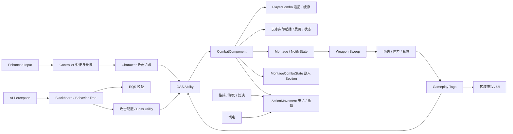

# 系统架构

工程只有一个 Runtime 模块 `SoulCombatLab`。目录按职责划分，玩家和敌人共享战斗执行，输入与 AI 负责发起请求。

模块源码按 Unreal 模块约定分为 `Public/` 与 `Private/`：头文件放在 `Public/`，实现文件放在 `Private/`，两侧继续镜像 `Combat/`、`Characters/`、`AbilitySystem/` 等功能子目录。模块内的 `.h` 与 `.cpp` 通过相同的功能路径配对，不再放在模块根目录的混合结构中。



## 攻击与命中

`ASCLDemoPlayerController` 持有全部 InputAction 与 MappingContext，在构造函数中定义动作与基础资产，在 PostInitializeComponents 中创建瞬态战斗键位映射（引用与绑定相同的实例动作），`SetupInputComponent` 调用 `BindPlayerActions` 绑定自身输入组件。`OnPossess` / `AcknowledgePossession` 安装本地映射，`OnUnPossess` / `EndPlay` 卸载映射并清理长按状态。回调通过 GetPawn 查询当前角色。Character 只执行移动与角色动作，不创建输入配置、不安装映射，也不需要 friend 访问。`USCLLightAttackAbility` 检查攻击资格并提交玩家输入；玩家费用与攻击状态在 Combat 实际起播处统一提交。敌人暂时保留原有 Ability/Section 费用流程。玩家的招式选择、输入缓存和连段图由 `USCLPlayerComboComponent` 管理；`USCLCombatComponent::RequestAttack` 分派到玩家或敌人的私有处理函数，保留共享的武器轨迹和命中执行。攻击播放 Montage，三个 NotifyState 分别管理连击输入、武器命中和无敌窗口。

读代码时注意三个位置：`SCLDemoPlayerController.cpp` 解释按键时长，`SCLPlayerCharacter.cpp` 中的 `RequestLightAttack` / `RequestHeavyAttack` 向 GAS 发起角色攻击，`SCLCombatComponent.cpp` 中的 `RequestAttack` 是玩家和敌人共用的执行入口。轻击 Ability 的 `GetAttackInput()` 返回 Light，重击覆盖为 Heavy；成本查询与 `RequestAttack(Input)` 显式接收同一输入，再由 CombatComponent 传给 ComboComponent。组件只保存等待动画窗口的真正连招缓存。蓝图兼容入口 `StartLightAttack` 暂时保留，内部转到 `RequestAttack`。

### 一次攻击请求返回什么

`CombatComponent::RequestAttack(Input)` 返回 `ESCLAttackRequestResult`：Rejected 是拒绝；Buffered 是输入已缓存，下一刀未执行、不扣下一刀费用；Executed 表示玩家已成功起播并在 Combat 完成扣费。玩家 Ability 不根据 Executed 再次提交费用。

Combo 不再返回攻击执行结果。`SelectAttack` 返回 `FSCLPlayerComboSelection`：有节点表示可尝试执行，`bBuffered` 表示只缓存，两者都没有则拒绝。Combat 拿到结果后自己编排执行，Combo 不引用也不反向调用 Combat。

玩家只有一个执行入口 `StartPlayerAttackStep(StepIndex)`，顺序为资源/体力/Effect 预检查 → 切换 Montage → 成功后扣费 → 确认节点与攻击状态。起手、窗口内即时接招和 Notify 消费缓存都使用这条路径；移除按提交者分工的布尔参数。费用直接来自已选 Step，玩家不需要起播前费用快照。敌人保持原来的 Section 与 Ability 费用行为，其快照明确命名为 `EnemyAttackCostSnapshot`。

玩家成本与状态 Effect 在 CombatComponent 的 `Combat|Player Effects` 配置，单招成本仍在 Moveset。零成本合法，负值与非有限成本被拒绝；可播放动画或 Effect 配置无效时，在切换当前动作前拒绝。缓存消费时体力不足，会丢弃本笔输入并保留当前攻击，恢复体力后不会自动重试。

缓存有效期在玩家蓝图的 `PlayerComboComponent → Combat|Combo → 连招输入缓存有效期` 中配置，属性名 `InputBufferLifetime`，默认仍为 0.7 秒；它与 Controller 的重击长按阈值是两个独立参数。

`USCLHitTraceComponent` 在有效窗口内对武器采样点执行上帧到本帧的 Sphere Sweep。命中目标先加入去重集合，再广播回调。角色伤害入口依次处理无敌、弹反、格挡和生命伤害；实际造成生命伤害后再结算对应韧性伤害。范围攻击使用独立查询，该招关闭武器 Trace，避免重复伤害。

两处中断保护决定了连段能否稳定恢复：

- 弹反回调可能同步取消攻击，清空正在遍历的 Trace 状态。`TraceGeneration` 在窗口开始和结束时递增，采样循环及回调返回后检查代次，失效就退出。
- 同一 Montage 可能在旧实例混出结束前重新播放。Combat 的 Playback 保存实例 ID，结束委托与 NotifyState 只处理所属实例，旧回调无法结束新攻击。

### 玩家刀术配置

玩家 C++ 基类头文件位于 `Public/Characters/Player/`，实现位于 `Private/Characters/Player/`。玩家蓝图子类位于 `/Game/SoulCombatLab/Blueprints/Player/BP_SCLPlayerSamurai`，负责模型、动画蓝图、刀鞘与招式资产配置；GameMode 蓝图子类位于 `/Game/SoulCombatLab/Blueprints/GameModes/BP_SCLPlayerGameMode`，选择玩家角色类。轻击、重击可从蓝图调用 `RequestLightAttack` / `RequestHeavyAttack`，输入计时和连招内部状态仍由 C++ 管理。

Controller 配置蓝图位于 `/Game/SoulCombatLab/Blueprints/Player/BP_SCLPlayerController`，继承 `ASCLDemoPlayerController`。`BP_SCLPlayerGameMode` 的 `Player Controller Class` 指向该蓝图生成类；原生 `ASCLGameMode` 中的 Controller 设置作为默认值保留。短按、长按和菜单按键实现仍继承 C++。重击时长阈值在 Controller 蓝图的 `HeavyAttackHoldThreshold`（重击长按阈值）中配置。

Content Browser 中的玩家相关目录如下：

```text
Content/SoulCombatLab/
├── Blueprints/
│   ├── Player/BP_SCLPlayerSamurai
│   ├── Player/BP_SCLPlayerController
│   └── GameModes/BP_SCLPlayerGameMode
└── Characters/Player/Combat/
    ├── Animations/                 # 玩家连招 Montage
    └── Data/DA_GhostSamurai_PlayerMoveset
```

`USCLPlayerMovesetData` 在 `Public/Data/` 定义每招的数据类型；玩家默认配置资产位于 `/Game/SoulCombatLab/Characters/Player/Combat/Data/DA_GhostSamurai_PlayerMoveset`。GhostSamurai 原始素材保留在 `GhostSamurai_Bundle/`；项目当前选用四段轻击和一个终止重击；添加 NotifyState 的 Montage 副本放在 `Characters/Player/Combat/Animations/`。新增招式先编辑 Moveset DataAsset，再补齐 Montage 的伤害与连招 Notify。

## 防御与处决

格挡消耗体力，体力不足进入破防；削韧和弹反可产生持续 4 秒的可处决状态。敌人在失衡窗口内停止攻击。

格挡成功激活后播放 `AM_PlayerBlockStart`，持续姿态由玩家动画蓝图的格挡八方向混合空间提供，当前 `GA_PlayerBlock.BlockEndMontage=None`，松开由 AnimBP 过渡回普通姿势（收势 Montage 为可选项）；格挡移动速度由 `BlockingSpeedMultiplier` 调节。弹反播放 `AM_PlayerParry`，只在 `ANS_SCLParryWindow` 标出的窗口持有 `State.Parrying`。动作结束或被打断时都移除判定状态并恢复移动朝向。

处决技能先检查目标、距离、朝向和胶囊路径；开始后播放 `AM_PlayerExecution`，`AN_SCLExecutionImpact` 通知结算伤害。玩家的 `MotionWarpingComponent` 在 `SCL_Execution` 窗口向有限距离内的目标点校正根位移，不再起手瞬移。结束或取消时移除校正目标并恢复移动朝向与 RootMotionMode。普通敌人处决直接击杀，Boss 处决扣除其当前生命的五分之一。目标敌人继续使用原有失衡、受伤和伤害流程，没有配对处决动画。

锁定攻击由 `SCLCombatComponent` 在有效目标、距离和胶囊扫掠通过时设置 `SCL_Attack` 目标点；当前选用的轻击与重击 Montage 在起招到接触前有 Motion Warping 窗口。超出距离或遇障碍时保留招式原本的根运动。`USCLPlayerAnimInstance` 把世界速度转成角色局部前后、左右速度，项目动画蓝图据此混合持刀、收刀和格挡的八方向步伐。当前普通和锁定移动共用 Apose/Movement/Run 的八向循环，约 350 cm / 0.8 秒；玩家蓝图普通步速与 TargetingComponent 的 `LockedWalkSpeed` 均配置为 437.5 cm/s，丢锁时恢复自由速度。斜向采样点使用 ±0.707，与归一化局部速度匹配。原生类的 180 cm/s 是无蓝图覆盖时的保守回退值，当前玩家使用蓝图配置。数值和通知时间以技能默认属性、Blend Space 采样点与 Montage 时间轴为准。

## 普通敌人与 Boss

`SCLBehaviorTreeBuilder` 原生创建 Blackboard 和 Behavior Tree，按死亡、失衡、战斗、追击、待机组织分支。Combat 执行攻击后请求 EQS 换位；无有效结果时短暂等待，避免重复请求形成紧循环。

EQS 生成环形候选点，结合距离、视线、可达性和侧向位置筛选。剑兵与重兵共享这套行为，通过 Archetype 配置区分生命、韧性、速度和伤害。

Boss 的 Utility 策略独立于攻击执行。六种招式为轻斩、重斩、突进、三连、范围攻击和延迟斩；评分考虑覆盖距离、当前阶段与近期攻击历史。立即重复扣 40 分，近期使用扣 25 分，范围攻击仅在二阶段参与选择。没有能覆盖目标的招式时返回 None。最终结果转换为运行时攻击参数，交给同一套 GAS 与 Combat 执行。

## 锁定与界面

锁定获取和切换时才查询候选，评分权重为距离 0.30、视角 0.25、屏幕中心 0.45。锁定期间启用 Tick 更新朝向、目标有效性与遮挡；解除后关闭。目标使用弱引用。

自由相机臂长 400 cm。锁定保存自由机位后应用 460 cm 臂长、Z 70 cm 支点与 Y 120 cm 肩侧偏移。切目标不覆盖保存值，所有解除路径恢复自由机位。

普通敌人的头顶血条独立绑定各自属性事件，死亡时隐藏，EndPlay 解绑。Boss 使用顶部血条。开发 HUD 与调试绘制按需启用，分别以 0.25 秒和 0.1 秒周期刷新。

## 区域推进与生命周期

`SCLDemoMap` 在运行时构建六个相连区域。清场后门解除碰撞，玩家步行推进；正常转区保留 Pawn，失败重试和胜利重开重建玩家。

重建玩家时，`USCLDemoSubsystem::StartStage` 查询当前 GameMode 对 Controller 配置的默认 Pawn 类，再生成该类。当前 `BP_SCLPlayerGameMode` 将 `PlayerCharacterClass` 配置为 `BP_SCLPlayerSamurai_C`；2026-09-28 的运行回归验证了重试后仍生成这一蓝图类。

死亡事件将流程判定延后到下一 tick，避免在伤害回调内销毁角色。若玩家与 Boss 同帧死亡，优先判定失败。重试先解除死亡监听和待处理计时器，再清理角色、AI 与武器；Controller 失去 Pawn 时卸载其安装的映射，控制新 Pawn 后重新安装相同对象；绑定与资产保留在 Controller。

## 相关代码

- [战斗组件](../Source/SoulCombatLab/Private/Combat/SCLCombatComponent.cpp)
- [左键短按与长按](../Source/SoulCombatLab/Private/Demo/SCLDemoPlayerController.cpp)
- [角色发起轻击与重击](../Source/SoulCombatLab/Private/Characters/Player/SCLPlayerCharacter.cpp)
- [武器采样](../Source/SoulCombatLab/Private/Combat/SCLHitTraceComponent.cpp)
- [Boss 策略](../Source/SoulCombatLab/Private/AI/Boss/SCLBossUtilityPolicy.cpp)
- [行为树构建](../Source/SoulCombatLab/Private/AI/SCLBehaviorTreeBuilder.cpp)
- [Demo 流程](../Source/SoulCombatLab/Private/Demo/SCLDemoSubsystem.cpp)

## 类职责与阅读顺序

| 类型 | 职责 | 从哪里读 |
| --- | --- | --- |
| SCLDemoPlayerController | 持有输入资产/键位、绑定与映射生命周期、按键解释及菜单热键 | SetupInputComponent、BindPlayerActions、OnPossess |
| SCLPlayerCharacter | 角色装配、执行移动与动作、保存当前身体的移动意图 | MoveInViewDirection、RequestLightAttack |
| SCLPlayerComboComponent | 选择连招节点、缓存输入和处理接招窗口 | SelectAttack、ResolveNextStep、OpenComboWindow |
| SCLCombatComponent | 编排选招、统一玩家起播/费用/状态、武器命中与取消清理 | RequestAttack、StartPlayerAttackStep |
| SCLPlayerDeveloperComponent | 开发场景摆位、测试敌人、定时伤害采样 | DebugTestBlock、DebugSpawnBossPrototype |

每个类对应一份 `.h` 和 `.cpp`。Character 上的控制台命令仅转发到开发组件；测试实现与临时 Boss 状态不再属于 Character。


## 玩家武器表现：收刀、拔刀和移动

- **当前默认暂停收刀与拔刀。** `USCLWeaponPresentationComponent::bEnableSheathDraw` 默认 `false`；不加载收/拔刀 Montage、不启动空闲计时器，剑留在手上，轻重攻击直接进入原 GAS/Combo。项目资产和下面的实现保留，之后可在玩家蓝图组件默认值里重新启用。
- 下面描述的是重新启用后的流程，当前运行时不会自动触发。
- `USCLWeaponPresentationComponent` 只负责空闲计时、收/拔刀 Montage、武器挂点与打断；没有常驻 Tick，也不决定招式、费用或伤害。
- 普通移动持续时仍能自动收刀，收刀动画期间角色可以移动。无战斗动作持续默认 3 秒后播放 2.7 秒 `AM_PlayerSheath`；1.5 秒通知把武器从 `weapon_rSocket` 切到 `katana_Targer01Socket`。`Scabbard_Target01Socket` 是刀鞘网格的挂点，不是刀的入鞘挂点。
- 入鞘后第一次轻/重攻击由组件记住一笔输入，并播放约 1.37 秒的 `AM_PlayerDraw`；0.30 秒通知将刀切回手部。动画结束后才回到角色原有的 GAS 轻/重攻击入口，费用在实际攻击起播时处理。
- 受击、闪避、格挡、弹反、处决或死亡取消收/拔刀；取消拔刀时丢弃尚未发出的攻击。动画实例身份用于拒绝旧通知。EndPlay 清理计时器和标签委托。
- 表现动画提取但丢弃根位移，并在结束/打断时恢复原根运动设置。资源副本通过 `Scripts/CreatePlayerSheathAnimation.py` 和 `Scripts/CreatePlayerDrawAnimation.py` 生成，不修改原 GhostSamurai 动画包。参数在玩家蓝图的 WeaponPresentationComponent → Weapon|Sheath 中设置。
- 本地完整教程的动画章解释流程、通知时刻和修改方法。

## 当前攻击结构：Combat 集中执行

| 位置 | 拥有的状态与工作 | 阅读入口 |
| --- | --- | --- |
| PlayerComboComponent | Moveset 节点、输入缓存、轻重后继 | SelectAttack / OpenComboWindow |
| CombatComponent | 攻击请求、费用与状态提交、装备、动画/范围执行、统一伤害 | RequestAttack / StartPlayerAttackStep / CancelActiveAttack |
| Combat 内部 Playback | Montage 弱引用、实例 ID、前摇目标与计时器 | PlayAttackMontage / FinishAttackPlayback |
| Combat 内部 AreaImpact | 范围计时器、半径、Pending 与取消代次 | ScheduleAreaImpact / ApplyAreaImpact / CancelAreaImpact |
| MontageComboState | 敌人当前、缓存、排队 Section；普通 C++ 状态对象 | Start / Buffer / Reset |
| ActionMovementComponent | 具名步速、朝向、根运动申请与基线 | SetWalkSpeedLimit / ReleaseRootMotionMode |

攻击动画与范围攻击属于 Combat 私有函数和成组状态；Character 不创建相应执行组件，也没有组件间 OnFinished / OnHit / OnCompleted 转发。一次攻击的起播、动画回调、范围命中与取消可以在同一份 cpp 按编号连续阅读。

源码阅读顺序：02 请求 → 03 玩家或 04 敌人 → 05 播放/结束 → 07 通知 → 08 范围或 09 武器伤害。06 位移、10 配置按需要查看。编号是代码区段，不是新的类或文件。

取消先使 Playback.InstanceId 失效再停止动画，并递增 AreaImpact.Generation。旧 Montage 回调与同步伤害回调返回后的旧范围遍历不能清理新攻击。FinishAttackIfReady 汇合两个结束时刻：动画结束而查询等待，保留配置；查询结束而动画播放，保留取消入口；两者都结束才清理。

Blueprint 攻击入口、Combo 的招式资产和 Combat 的 Motion Warping 参数位置保持一致。收刀、拔刀默认继续关闭。源码职责明确，仍需独立验证行为；具体本轮证据见 Testing.md。

统一移动管理继续保留：速度 = 基础值与所有上限的最小值 × 所有倍率；动作只撤销自己的申请。武器表现根运动优先级 10，战斗动作 100，同级后申请优先。基础速度配置使用 SetBaseWalkSpeed。


## 防御与处决技能的蓝图配置

C++ 的 Block / Parry / Execution Ability 提供动作判定与执行逻辑。项目配置蓝图位于 `Content/SoulCombatLab/Characters/Player/Combat/Abilities/`：`GA_PlayerBlock`、`GA_PlayerParry`、`GA_PlayerExecution`。在 Class Defaults 的 `Ability|Animation` 配置 Montage；格挡速度在 `Ability|Movement`，处决距离和朝向要求在 `Ability|Targeting`。

玩家蓝图 `BP_SCLPlayerSamurai` 的 `StartupAbilities` 选择实际授予的类；更换配置时替换该动作的原数组项。格挡持续姿态/移动仍由 `BS_PlayerBlock8Way` 与项目 AnimBP 管理。弹反窗口、处决命中时刻和位移校正窗口仍由配置 Montage 的 Notify / Motion Warping 决定。

`USCLAbilitySystemComponent::FindAbilitySpecByBaseClass` 使用继承关系查找已授予的技能，优先返回活动记录。松开格挡与弹反、处决通知从该记录取得实际实例，技能内部继续检查 Montage 实例 ID。原生和任意层级的蓝图子类均能走相同入口；同一动作不应同时授予父类和子类。

`CreatePlayerAbilityBlueprints.py` 建立配置资产并接入玩家，重复运行保留已有配置与用户选择的派生技能；`VerifyPlayerAbilityBlueprints.py` 在独立进程读取保存配置。本次验证结果见 Testing.md。

成功弹反现在由活动的 `USCLParryAbility::ApplyCounterDamage` 结算一次生命伤害。默认值位于 `GA_PlayerParry → Ability|Damage → CounterDamage`，为 20；同一动作中的后续成功拦截不再次扣血，新的弹反动作重置结算标记。伤害进入攻击者 TakeDamage/GAS 死亡流程，击杀后不再播放失衡受击动作。


## 八向闪避（2026-10-03）

现有 USCLDodgeAbility / GA_PlayerDodge 负责动作，不新增组件。Controller 解释输入，Character 缓存视角移动意图并请求 Ability.Dodge。技能将世界方向转成角色局部八向，读取 DirectionalMontages 配置；验证动画后支付 25 体力，再申请 Dodging 状态、朝向限制及 IgnoreRootMotion。MoveToForce 负责默认 450 cm 胶囊位移，动画只提供姿势。闪避时普通移动不额外推进，锁定组件暂缓角色转向，镜头仍跟踪目标。

八个项目 Montage 来自 GhostSamurai_APose_Dodge_{F,FR,R,BR,B,BL,L,FL}_Root，原件保留。SCL Invincible 通知默认 0.10～0.60 秒，通知 Begin/End 添加/移除 State.Invincible。结束或中断释放本次动作申请，保留锁定的申请；不再人工旋转整个 Mesh。方向表缺项拒绝启动，只有完全没有方向表的旧角色才使用单动画兼容配置。
