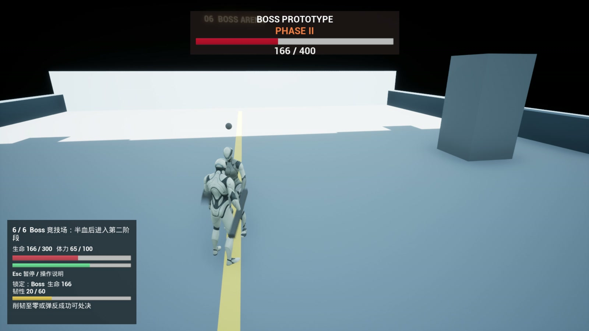

# 刀术试炼 / Blade Trial

`SoulCombatLab` 是内部 UE 工程名。本项目基于 Unreal Engine 5.8 和 C++，展示第三人称近战战斗系统。六个相连区域串起训练、剑兵、重兵、双敌战斗和双阶段 Boss，包含连击、防御、弹反、处决、目标锁定与失败重试。



[系统架构](Docs/Architecture.md) · [测试](Docs/Testing.md) · [性能记录](Docs/Performance.md)

## 主要实现

- **职责分离**：Controller 解释输入，Combo 选择招式，Combat 集中管理攻击播放、范围查询、费用与伤害。锁定、格挡等动作通过 ActionMovement 组合移动限制，各自释放自己的申请。
- **技能蓝图配置**：在 `Combat/Abilities/GA_PlayerBlock`、`GA_PlayerParry`、`GA_PlayerExecution` 的 Class Defaults 调整动画与参数；玩家 `StartupAbilities` 选择实际授予类。配置步骤见 HTML 第 10 章。
- **GAS 战斗状态**：玩家轻重技能检查资格并提交输入；Combat 在真正起播时统一提交攻击消耗和状态。Gameplay Effect 修改生命、体力和韧性，Gameplay Tag 约束攻击、防御、失衡与死亡状态。
- **动画驱动命中**：Montage 与 NotifyState 控制连击输入窗口、无敌窗口和武器 Sweep；同一命中窗口对目标去重。
- **中断与恢复**：Trace 代次校验处理弹反回调中的同步重入；Montage 实例 ID 隔离旧动画回调，避免受击后新连段被旧实例清理。
- **敌人决策**：AI Perception 提供目标信息，C++ 构建 Blackboard 和 Behavior Tree，EQS 选择换位位置。Boss 用距离、阶段和出招历史给六种攻击评分。
- **锁定与镜头**：按距离、视角及屏幕中心评分选择目标，支持滚轮切换；锁定时调整机位，解除或目标失效后恢复自由镜头。
- **关卡流程**：清场开门、Boss 入场封门、区域重试和胜利重开；重生时清理角色、AI、武器、输入映射和事件监听。

玩法逻辑使用 C++，动画使用 AnimBP、Montage 等资源。角色与基础动画来自 Epic 的第三人称模板；GhostSamurai 刀术、武器和特效属于外部素材。地图为运行时构造的灰盒场景，详见[资源说明](THIRD_PARTY_NOTICES.md)。

学习入口：[完整中文 HTML 课程](Docs/从0理解SoulCombatLab_完整课程.html)。先看第 02 章的职责表和“第一刀到缓存第二刀”调用链，再读第 07 章的动画与移动限制。课程链接直接指向当前源码；页面连招演示是教学模型，实际游戏验证见[测试记录](Docs/Testing.md)。

## 获取与构建

环境要求：Windows、Unreal Engine 5.8、Visual Studio 的 C++ 游戏开发工具链、Git LFS，以及自行取得的 GhostSamurai 素材包。

> **资源边界：**当前私有仓库不包含 `Content/GhostSamurai_Bundle/`，也未纳入本地新增的素材包动画序列、Montage 和 Niagara 特效副本。克隆仓库可以阅读 C++ 与文档；要在编辑器中完整运行战斗 Demo，需先把已获许可的素材安装到 `Content/GhostSamurai_Bundle/`，再参考 `Scripts/` 中的资源生成与配置脚本补齐项目副本。仅编译 C++ 不代表动画和特效资源已恢复。

```powershell
git lfs install
git clone https://github.com/icecream863/blade-trial-ue5.git
cd blade-trial-ue5
git lfs pull
```

右键 `SoulCombatLab.uproject` 生成 Visual Studio 工程文件，编译 `Development Editor / Win64`，再打开工程。默认地图为 `/Game/Maps/L_CombatLab`。

日常编译使用项目脚本，构建日志保存在 `Saved/BuildLogs`。脚本先检查现有 UBT Trace 备份文件是否可写；权限错误会在启动构建前明确报出：

```powershell
.\Scripts\BuildUnrealTarget.ps1 -EngineRoot 'E:\Epic Games\UE_5.8'
```

生成独立可玩包：

```powershell
.\Scripts\BuildPlayableDemo.ps1 -EngineRoot 'C:\Program Files\Epic Games\UE_5.8'
```

将引擎路径改为实际安装位置。脚本构建 Editor 和 Game，随后执行 Cook、Stage、Pak 与 Archive。输出入口为 `Builds/PlayableDemo/Windows/SoulCombatLab.exe`；运行或分发时保留整个 `Windows` 目录。

构建脚本将普通日志写入 `Saved/BuildLogs`，并提前检查用户目录中 UBT trace 备份的访问权限。UE 5.8 使用系统 API 获取 trace 目录，修改 `LOCALAPPDATA` 并不能重定向它；权限检查失败会给出明确错误。

## 操作

| 操作 | 按键 |
| --- | --- |
| 移动 / 视角 | WASD 或方向键 / 鼠标 |
| 轻攻击与连击 | 鼠标左键 |
| 翻滚 / 跳跃 | 左 Shift / 空格 |
| 格挡 / 弹反 | 按住右键 / Q |
| 处决 | 目标可处决时按 E |
| 锁定 / 切换目标 | 鼠标中键 / 滚轮 |
| 开始 / 跳过训练 | Enter |
| 暂停与操作说明 | Esc |
| 失败重试 | R 或 Enter |

清场后沿金线进入下一区域。进入区域时恢复玩家生命与体力；失败从当前区域重试。Boss 为 400 生命，半血进入二阶段。

## 代码入口

| 路径 | 职责 |
| --- | --- |
| `Source/SoulCombatLab/Public` | 跨功能使用的模块头文件；按 AbilitySystem、Combat、AI、Characters、Demo 等子目录组织 |
| `Source/SoulCombatLab/Private` | C++ 实现与测试；沿用相同的功能子目录，内部实现细节留在 Private |

当前范围为单人 Windows Development Demo。尚无跨进程存档、联网玩法或正式美术关卡。

## 从哪里开始读代码

打开 [完整源码课程](Docs/从0理解SoulCombatLab_完整课程.html)，按 00 → 14 阅读正文、源码节选和自测答案。第 04 章可交互演示连招，第 13 章提供修改步骤与排错表；还可用“类职责速查”搜索中文职责和英文类名。每个类只有一份头文件和实现。

头文件中文职责变动后，运行 `python Scripts/UpdateLearningCatalog.py` 同步 HTML 的类速查表。
